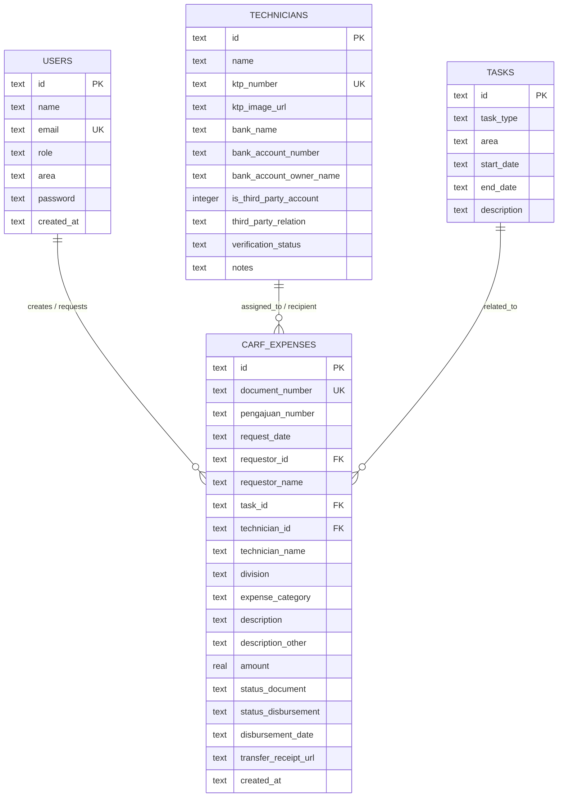

# Project NSD (CARF & Expenses Management)

Aplikasi manajemen pencatatan CARF, pengeluaran, teknisi, dan penugasan lapangan yang dibuat dengan React (Frontend) dan Express + SQLite WASM (Backend).

## Prasyarat
Pastikan Anda sudah menginstal:
- [Node.js](https://nodejs.org/) (versi 18 atau lebih baru direkomendasikan)
- npm (bawaan dari instalasi Node.js)

## Cara Menjalankan Aplikasi

### 1. Instalasi Dependensi
Sebelum menjalankan aplikasi untuk pertama kali, Anda perlu menginstal dependensi di direktori utama (root) dan di direktori server.

Buka terminal di direktori proyek dan jalankan perintah berikut secara berurutan:

```bash
# Menginstal dependensi untuk Frontend dan root utilities
npm install

# Menginstal dependensi untuk Backend
cd server
npm install
cd ..
```

### 2. Menjalankan Server & Frontend Sekaligus
Untuk memudahkan pengembangan, Anda dapat menjalankan server backend dan server frontend secara bersamaan menggunakan satu perintah:

```bash
npm run dev:all
```

Perintah ini akan menjalankan:
- **Frontend (Vite):** Biasanya berjalan di [http://localhost:5173](http://localhost:5173)
- **Backend (Express):** Berjalan di [http://localhost:3001](http://localhost:3001)

### 3. Menjalankan Secara Terpisah (Opsional)
Jika Anda ingin menjalankannya secara terpisah di terminal yang berbeda:

* **Menjalankan Frontend saja:**
  ```bash
  npm run dev:fe
  ```

* **Menjalankan Backend saja:**
  ```bash
  npm run dev:server
  ```

### 4. Seed Data Database (Opsional)
Jika database Anda kosong dan Anda ingin mengisi data awal (seperti data user default, teknisi, dll.), Anda bisa menjalankan script seed di folder server:

```bash
cd server
npm run seed
```
## Entity Relationship Diagram (ERD)



