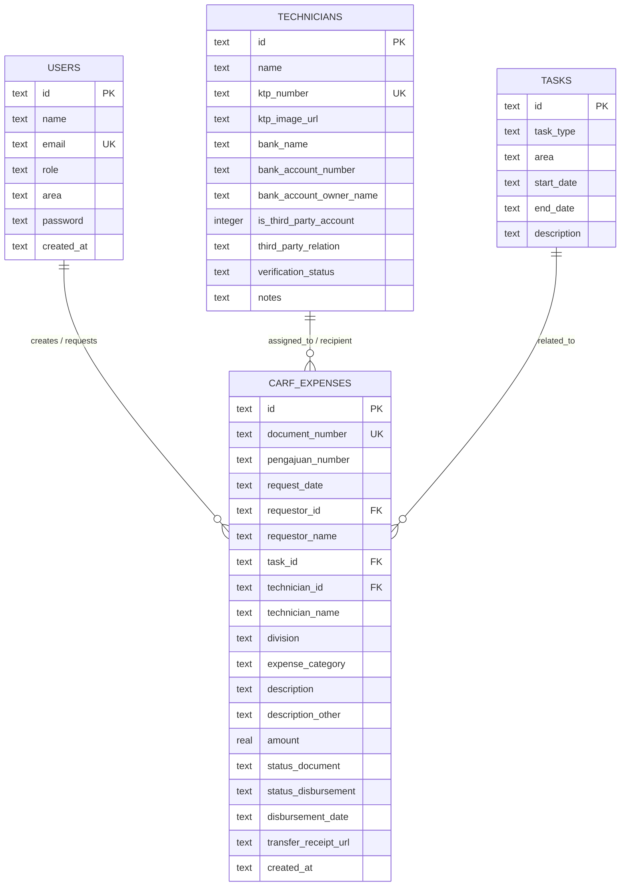

# NSD Portal (Network Service Division Portal)
### Aplikasi Web Pengelolaan Laporan Biaya Operasional Divisi Construction PT Mahaga Pratama

Aplikasi web modern yang dikembangkan untuk mengotomatisasi proses pengelolaan administrasi Cash Advance Request Form (CARF), pembuatan dokumen Cover Report (*Non-Travel Expense Report*) dan Kwitansi secara otomatis, manajemen basis data teknisi beserta verifikasi KTP, serta import data pengajuan secara massal.

Dikembangkan menggunakan arsitektur modern berbasis **Next.js, React.js, TypeScript, dan Tailwind CSS**, serta telah di-deploy dan dapat diakses publik pada platform cloud **Vercel**: [https://nsd-six.vercel.app/](https://nsd-six.vercel.app/).

---

## 🎯 Fitur-Fitur Utama (Sesuai Laporan Bab IV)

Sesuai dengan **Tabel 4.1 Fitur-fitur Aplikasi NSD Portal**:
1. **Dashboard Analitik**: Menampilkan ringkasan kartu statistik total pengajuan CARF, status dokumen pending, persentase dokumen selesai & diprint, total realisasi dana, dan visualisasi progress bar.
2. **Data CARF & Pengeluaran**: Manajemen data pengajuan dengan tabel data komprehensif, pencarian cepat, serta filter status dokumen dan pembayaran.
3. **Generate Cover Report Otomatis**: Menghasilkan dokumen *Non-Travel Expense Report* resmi standar PT Mahaga Pratama secara instan (< 5 detik).
4. **Generate Kwitansi Otomatis**: Pembuatan dokumen kwitansi yang terintegrasi langsung dengan Cover Report, konversi nilai nominal ke terbilang otomatis, serta lampiran foto KTP teknisi untuk verifikasi identitas.
5. **Manajemen Teknisi**: Basis data teknisi terpusat dengan pencatatan NIK, foto KTP, dan status verifikasi (*Verified / Unverified / Rejected*).
6. **Wizard Import Data CARF**: Modul impor data pengajuan secara massal dari berkas spreadsheet (.xlsx, .csv) melalui alur tiga tahap (*Upload File, Mapping Kolom, Preview & Validasi*).

---

## 🛠️ Teknologi yang Digunakan (Tabel 3.1 Laporan KP)

| Teknologi | Peran dalam NSD Portal |
| :--- | :--- |
| **Next.js** | Framework utama (React-based) untuk front-end sekaligus back-end (API Routes) dalam satu proyek terintegrasi |
| **React.js** | Membangun antarmuka berbasis komponen yang reusable, dengan Virtual DOM untuk rendering yang efisien |
| **TypeScript** | Static typing di atas JavaScript untuk mengurangi bug tipe data dan mempermudah maintenance kode |
| **Tailwind CSS** | Utility-first CSS untuk membangun tampilan responsif secara cepat tanpa menulis CSS custom |
| **Vercel** | Platform deployment dengan continuous deployment terintegrasi GitHub; aplikasi diakses di [nsd-six.vercel.app](https://nsd-six.vercel.app/) |

---

## 🚀 Panduan Menjalankan Aplikasi Secara Lokal

### Prasyarat
- [Node.js](https://nodejs.org/) (versi 18 atau lebih baru)
- npm (Node Package Manager)

### 1. Instalasi Dependensi
Jalankan perintah berikut di direktori proyek:
```bash
npm install
```

### 2. Menjalankan Aplikasi (Mode Development)
Untuk menjalankan aplikasi secara lokal:
```bash
npm run dev
```
Aplikasi dapat dibuka melalui browser di: `http://localhost:5173`

### 3. Build Produksi
Untuk mengompilasi kode program ke bundle produksi:
```bash
npm run build
```
## Entity Relationship Diagram (ERD)



---

## 🌐 Deployment Publik

Aplikasi telah berhasil di-deploy ke cloud Vercel dan terhubung dengan continuous deployment repositori GitHub:
- **URL Akses Publik:** [https://nsd-six.vercel.app/](https://nsd-six.vercel.app/)
